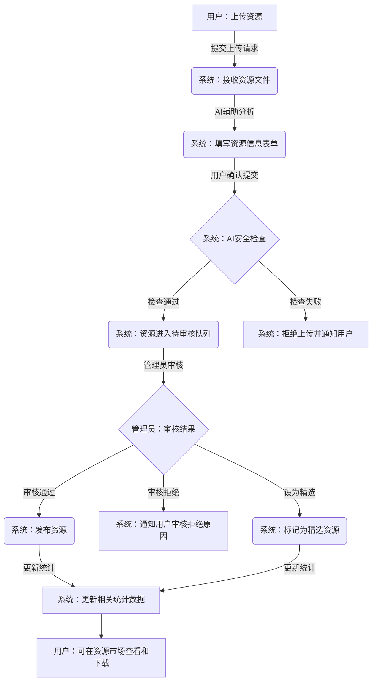
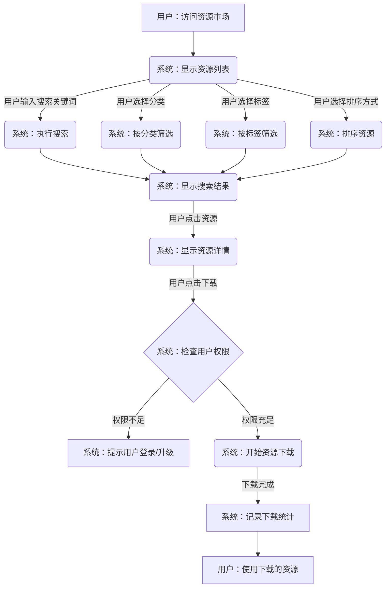
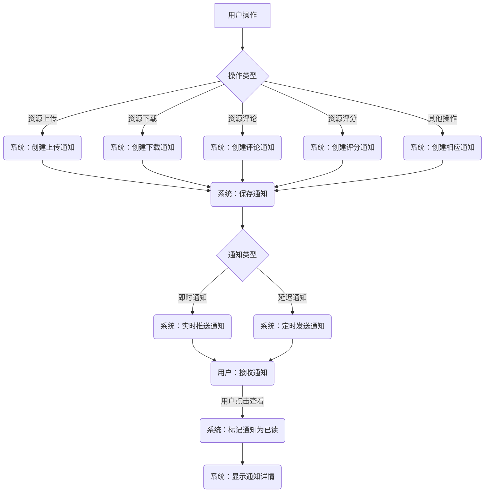
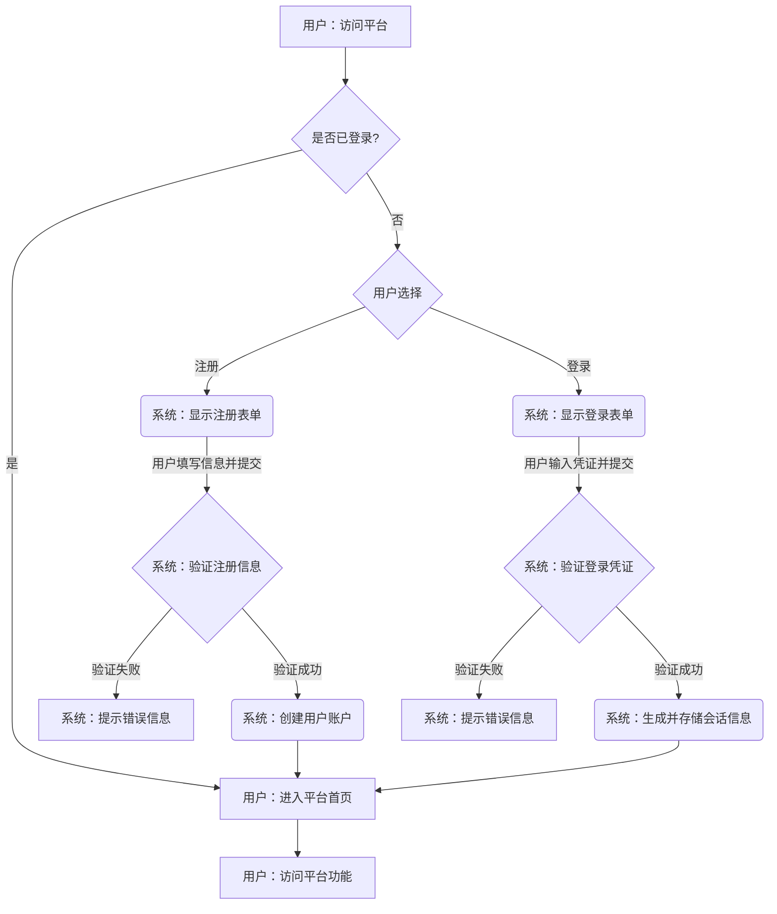
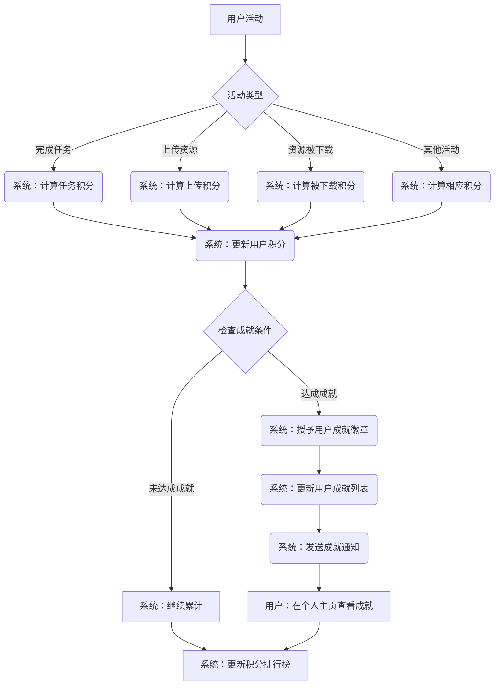

# ResourceHub 资源市场平台核心流程流程图

## 1. 资源上传审核流程

## 2. 资源搜索与下载流程

## 3. 用户操作与通知流程

## 4. 用户注册与登录流程

## 5. 社区积分与成就系统流程

## 使用说明

以上流程图展示了ResourceHub资源市场平台的核心业务流程。您可以将这些mermaid代码复制到支持mermaid的编辑器或查看器中，即可生成可视化的流程图。

主要流程图包括：
1. 资源上传审核流程 - 从用户上传资源到管理员审核通过的完整过程
2. 资源搜索与下载流程 - 用户如何查找和获取所需资源
3. 用户操作与通知流程 - 系统如何处理用户操作并发送相应通知
4. 用户注册与登录流程 - 新用户注册和已有用户登录的流程
5. 社区积分与成就系统流程 - 用户如何通过活动获取积分和成就徽章

这些流程图可以帮助您更好地理解系统的整体架构和业务逻辑。